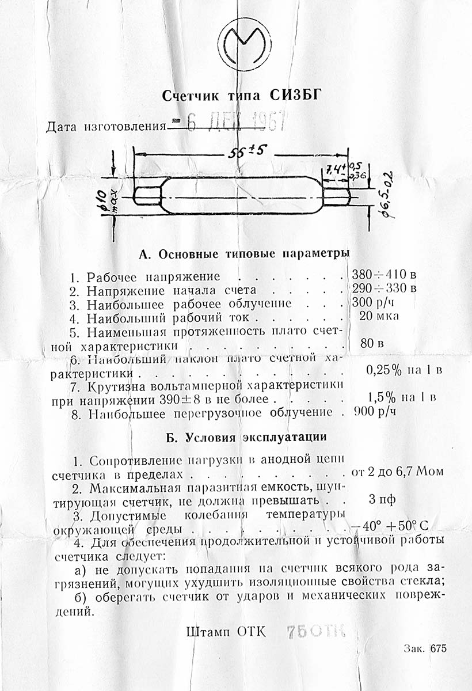

# GergerCounter

Geiger Miller counter module based on SI3BG(СИ3БГ).

## Introduction

Russian military compact Geiger Muller Tube SI-3BG for detecting ionising radiation. Can detect beta and gamma radiation.

Datasheet(One version):

- Рабочее напряжение: 380 - 410 в

- Working voltage: 380 - 410 V (Another version is 380 - 460 V)

- Напряжение начала счета: 290 - 330 в

- Starting counting voltage: 290 - 330 V

- Наибольшее рабочее облучение: 1300 р/ч

- Maximum working exposure: 1300 r/h

- Наибольший рабочий ток: 20 мка

- Maximum working current: 20 mA

- Наименьшая протяженность плато счетной характеристики: 80 в

- Minimimum length of the plateau of the counting characteristic: 80 V

- Наибольший наклон плато счетной характеристики: 0,25% на 1 в

- Maximum slope of the plateau of the counting characteristic: 0.25% per 1 V

- Крутизна вольтам мерной характеристики при напряжении 390±8 в не более: 1,5% на 1 в

- The slope of the volt-on-meter characteristic at a voltage of 390 ± 8 V, no more than: 1.5% per 1 V

- Наибольшее перегрузочное облучение . 900 р/ч

- Maximum overload irradiation: 900 r/h

## Hardware

Refer to `Hardware` folder. The board is drawn by Altium Designer 21. 

## Firmware

Refer to `Firmware` folder. The firmware is based on Arduino platform and PlatformIO IDE. The demo runs on a stm32 board and a ssd1306/ssd1315 oled screen. You can modify the pins of the OLED screen and the external interrupt pins of the counter by modifying the pin definitions at the beginning of the program to migrate to other boards that support Arduino.

To be continued... ╰(￣ω￣ｏ)
